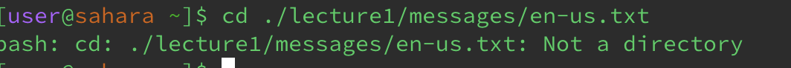
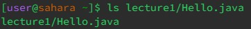
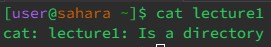
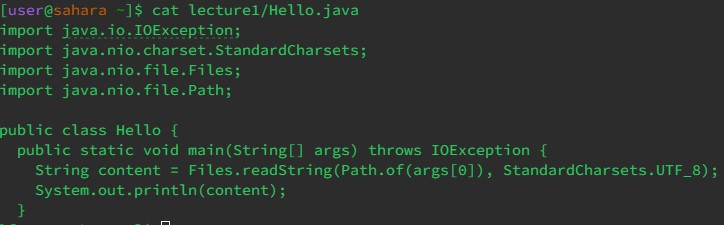

# Lab Report 1
## cd Command

* the working directory is home
* when the cd command does not receive any argument, it will get back to the home directory. In this case, it is already in the home directory, so nothing was being changed
* It is not an error

* the working directory is home
* when the cd command is used with a path to a directory as an argument, it will take us to that directory and set it as the current working directory
* It is not an error

* the working directory is home
* when the cd command is used with a path to a file as an argument, an error occur
* an error occur as the cd command only works on a directory as an argument

## ls Command

* the working directory is home
* when the ls command does not receive any argument, it will list all the files and folders in the current working directory
* It is not an error

* the working directory is home
* when the ls command is used with a path to a directory as an argument, it will list all the files and folders in the given directory
* It is not an error

* the working directory is home
* when the ls command is used with a path to a file as an argument, it will just list the file that is being passed as the argument
* it is not an error

## cat Command

* the working directory is home
* when the cat command does not receive any argument, an error occur
* it is not an error

* the working directory is home
* when the cat command is used with a path to a directory as an argument, an error occur
* It is an error because the cat command only take a file as an argument

* the working directory is home
* when the cd command is used with a path to a file as an argument, it will print out everthing in the file that is being passed in the argument
* it is not an error
