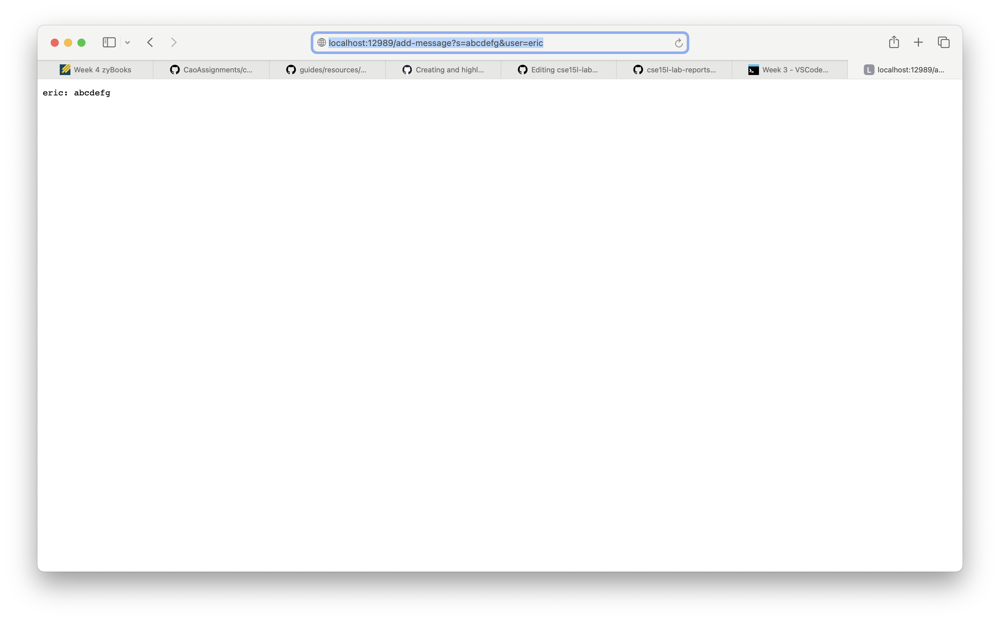
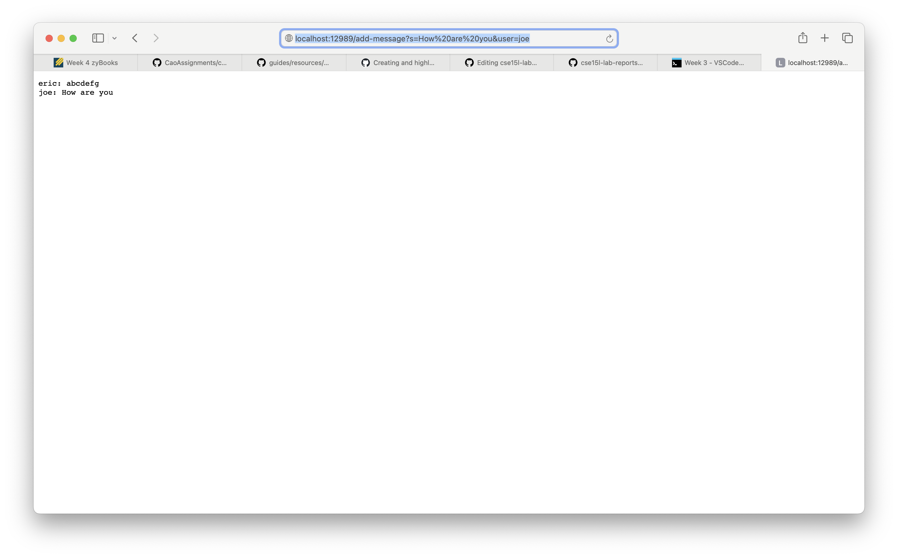
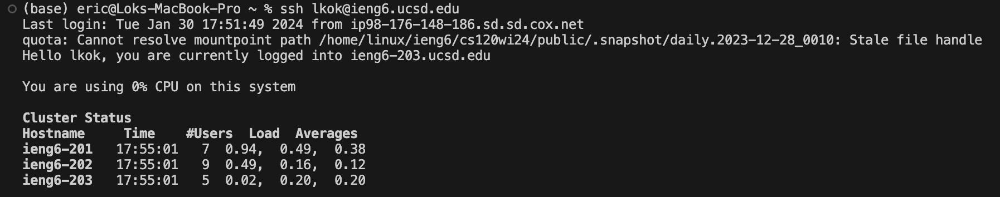

# Lab Report 2
## Part 1
Chat Server Code
```java
import java.io.IOException;
import java.net.URI;
import java.util.ArrayList;

class Handler implements URLHandler{
    ArrayList<String> line = new ArrayList<>();
    public String handleRequest(URI url){
        if(url.getPath().equals("/add-message")){
            String[] parameter = url.getQuery().split("&");
            String[] par1 = parameter[0].split("=");
            String[] par2 = parameter[1].split("=");
            if(par1[0].equals("s") && par2[0].equals("user")){
                line.add(par2[1] + ": " +par1[1] + " \n");
                String res = "";
                for(String i:line){
                    res+= i;
                }
                return res;
            }
        }
        return "404 Not Found";
    }
}

class ChatServer{
    public static void main(String args[]) throws IOException{
        if(args.length == 0){
            System.out.println("Missing port number! Please try any number between 1024 to 49151");
            return;
        }
        int port = Integer.parseInt(args[0]);
        Server.start(port, new Handler());
    }
}
```

* The handleRequest Method is being called
* The relevant fields to this method is the line ArrayList
* When there is a request of "add-message" the ArrayList is updated by adding the user and message to the array list. In this picture, user "eric" and the message "abcdefg" is added to the arraylist.


* The handleRequest Method is being called
* The relevant fields to this method is the line ArrayList
* When there is a request of "add-message" the ArrayList is updated by adding the user and message to the array list. In this picture, user "joe" and the message "How are you" is added to the arraylist.

## Part 2



* When I log into my ieng6 account, this time it did not prompt me for entering the password. That means the key is successfully saved in my computer.

## Part 3
From the previous labs I have learnt many things that I did not know before. First, I learnt how to host a local server on my computer and handle different kind of requests. I also learnt some new commands that can be used in terminal such as ssh, mkdir. I also learnt about saving keys on my computers to log into the ieng6 account without entering a password.
