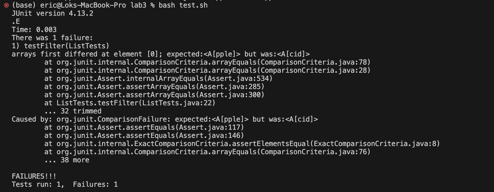
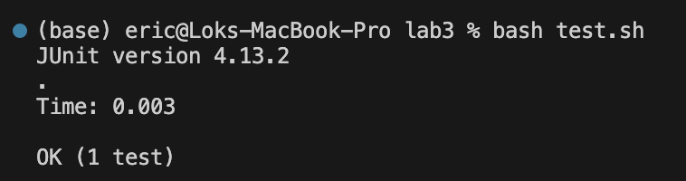

# Lab Report 3
## Part 1
The bug that I choose is the List methods bugs.
### Failure inducing input Test Code
```java
import static org.junit.Assert.*;
import org.junit.*;
import java.util.ArrayList;
import java.util.List;

public class ListTests {
    @Test 
    public void testFilter(){
        List<String> l1 = new ArrayList<>();
        l1.add("Apple");
        l1.add("Banana");
        l1.add("Acid");
        StringChecker sc = new StringChecker() {
            public boolean checkString(String s){
                return s.startsWith("A");
            }
        };
        List<String> l2 = ListExamples.filter(l1,sc);
        List<String> l3 = new ArrayList<>();
        l3.add("Apple");
        l3.add("Succ");//l3 = {"Apple","Acid"}
        assertArrayEquals(l3.toArray(), l2.toArray());
    }
}
```

### Successful inducing input Test Code
```java
import static org.junit.Assert.*;
import org.junit.*;
import java.util.ArrayList;
import java.util.List;

public class ListTests {
    @Test 
    public void testFilter(){
        List<String> l1 = new ArrayList<>();
        l1.add("Apple");
        l1.add("Banana");
        l1.add("Acid");
        StringChecker sc = new StringChecker() {
            public boolean checkString(String s){
                return s.startsWith("A");
            }
        };
        List<String> l2 = ListExamples.filter(l1,sc);
        List<String> l3 = new ArrayList<>();
        l3.add("Acid");
        l3.add("Apple");//l3 = {"Acid","Apple"}
        assertArrayEquals(l3.toArray(), l2.toArray());
    }
}
```
### Symptoms

This test fails because the expecting list was {"Apple","Acid"} but the output was {"Acid","Apple"}

This test success because the expected list is the same as the output list

The symptoms of this method is that the method creates a reversed list compared to the expected list.

### Fix
Before
```java
static List<String> filter(List<String> list, StringChecker sc) {
    List<String> result = new ArrayList<>();
    for(String s: list) {
      if(sc.checkString(s)) {
        result.add(0, s);
      }
    }
    return result;
}
```

After
```java
static List<String> filter(List<String> list, StringChecker sc) {
    List<String> result = new ArrayList<>();
    for(String s: list) {
      if(sc.checkString(s)) {
        result.add(s);
      }
    }
    return result;
}
```
Since the list method add has different implementations according to the java documentation. One is including the index and one without the index. if we include to the parameter when we are calling the method, we will add the element at the index. If we do not include the index, we will append to the list. Therefore, to fix the bug, we only have to change the add method to just putting the element we want to add to the parameter. 

## Part 2
The command that I choose is the find command, and I ask Chatgpt to give me some interesting command line option.
Here is the screenshot:

