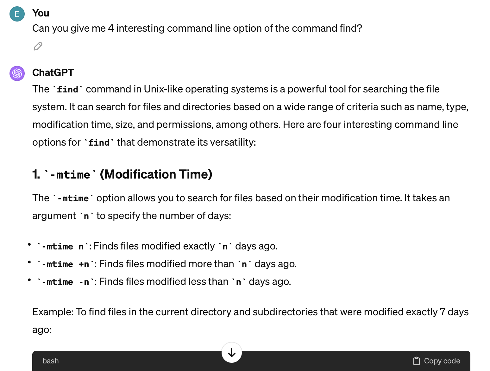
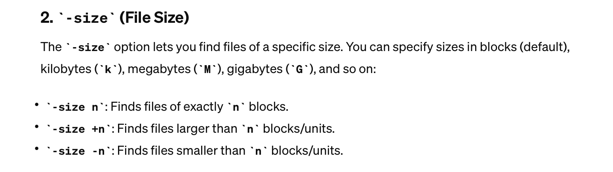
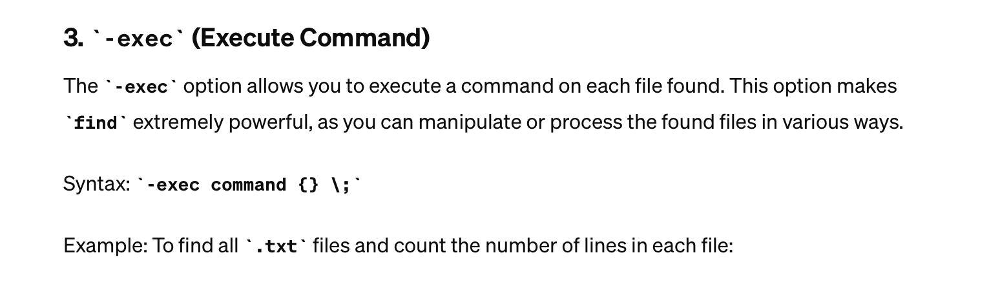
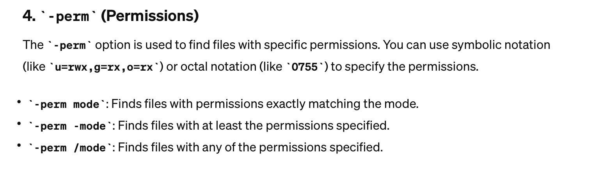

# Lab Report 3
## Part 1
The bug that I choose is the List methods bugs.
### Failure inducing input Test Code
```java
import static org.junit.Assert.*;
import org.junit.*;
import java.util.ArrayList;
import java.util.List;

public class ListTests {
    @Test 
    public void testFilter(){
        List<String> l1 = new ArrayList<>();
        l1.add("Apple");
        l1.add("Banana");
        l1.add("Acid");
        StringChecker sc = new StringChecker() {
            public boolean checkString(String s){
                return s.startsWith("A");
            }
        };
        List<String> l2 = ListExamples.filter(l1,sc);
        List<String> l3 = new ArrayList<>();
        l3.add("Apple");
        l3.add("Succ");//l3 = {"Apple","Acid"}
        assertArrayEquals(l3.toArray(), l2.toArray());
    }
}
```

### Successful inducing input Test Code
```java
import static org.junit.Assert.*;
import org.junit.*;
import java.util.ArrayList;
import java.util.List;

public class ListTests {
    @Test 
    public void testFilter(){
        List<String> l1 = new ArrayList<>();
        l1.add("Apple");
        l1.add("Banana");
        l1.add("Acid");
        StringChecker sc = new StringChecker() {
            public boolean checkString(String s){
                return s.startsWith("A");
            }
        };
        List<String> l2 = ListExamples.filter(l1,sc);
        List<String> l3 = new ArrayList<>();
        l3.add("Acid");
        l3.add("Apple");//l3 = {"Acid","Apple"}
        assertArrayEquals(l3.toArray(), l2.toArray());
    }
}
```
### Symptoms

This test fails because the expecting list was {"Apple","Acid"} but the output was {"Acid","Apple"}

This test success because the expected list is the same as the output list

The symptoms of this method is that the method creates a reversed list compared to the expected list.

### Fix
Before
```java
static List<String> filter(List<String> list, StringChecker sc) {
    List<String> result = new ArrayList<>();
    for(String s: list) {
      if(sc.checkString(s)) {
        result.add(0, s);
      }
    }
    return result;
}
```

After
```java
static List<String> filter(List<String> list, StringChecker sc) {
    List<String> result = new ArrayList<>();
    for(String s: list) {
      if(sc.checkString(s)) {
        result.add(s);
      }
    }
    return result;
}
```
Since the list method add has different implementations according to the java documentation. One is including the index and one without the index. if we include to the parameter when we are calling the method, we will add the element at the index. If we do not include the index, we will append to the list. Therefore, to fix the bug, we only have to change the add method to just putting the element we want to add to the parameter. 

## Part 2
The command that I choose is the find command, and I ask Chatgpt to give me some interesting command line option.
Here is the screenshot:





### -mtime command line option
```
find ./technical/911report  -mtime -7
./technical/911report
./technical/911report/chapter-13.4.txt
./technical/911report/chapter-13.5.txt
./technical/911report/chapter-13.1.txt
./technical/911report/chapter-13.2.txt
./technical/911report/chapter-13.3.txt
./technical/911report/chapter-3.txt
./technical/911report/chapter-2.txt
./technical/911report/chapter-1.txt
./technical/911report/chapter-5.txt
./technical/911report/chapter-6.txt
./technical/911report/chapter-7.txt
./technical/911report/chapter-9.txt
./technical/911report/chapter-8.txt
./technical/911report/preface.txt
./technical/911report/chapter-12.txt
./technical/911report/chapter-10.txt
./technical/911report/chapter-11.txt
```
The command line option mtime means the modification time and the argument -7 means that less than 7 days ago. Using this option will find all the files that are modified less than 7 days ago in that directory. Since I downloaded the files 5 days ago, it will show all the files in that directories.

```
find ./technical/911report  -mtime 7
```
The argument 7 means that exactly 7 days ago. Since my files are all modified 5 days ago, it will not output anything.

### -size command line option
```
find ./technical/911report  -size +1
./technical/911report
./technical/911report/chapter-13.4.txt
./technical/911report/chapter-13.5.txt
./technical/911report/chapter-13.1.txt
./technical/911report/chapter-13.2.txt
./technical/911report/chapter-13.3.txt
./technical/911report/chapter-3.txt
./technical/911report/chapter-2.txt
./technical/911report/chapter-1.txt
./technical/911report/chapter-5.txt
./technical/911report/chapter-6.txt
./technical/911report/chapter-7.txt
./technical/911report/chapter-9.txt
./technical/911report/chapter-8.txt
./technical/911report/preface.txt
./technical/911report/chapter-12.txt
./technical/911report/chapter-10.txt
./technical/911report/chapter-11.txt
```
The command line option means the size of the file, the argument +1 means that larger than 1(the default unit of this command is kilobytes). Since every files in this directory is larger than 1k, it will output every files.

```
find ./technical/911report  -size 1
```
The argument of this command is finding files that has exactly 1k of size. Since there are no files with size of 1k, it will not output anything.

### -inum command line option
```
find ./technical/911report -inum 16948134
./technical/911report/chapter-3.txt
```
The inum command line will find the file with matching inode. The argument 16948134 is the inode number of the file you want to find.
```
find ./technical/911report -inum 16948
```
The argument here is 16948. It does not have any output since there are no matching file with that inode number

### -perm command line option
```
find ./technical/911report -perm 0755
./technical/911report
./technical/911report/chapter-13.4.txt
./technical/911report/chapter-13.5.txt
./technical/911report/chapter-13.1.txt
./technical/911report/chapter-13.2.txt
./technical/911report/chapter-13.3.txt
./technical/911report/chapter-3.txt
./technical/911report/chapter-2.txt
./technical/911report/chapter-1.txt
./technical/911report/chapter-5.txt
./technical/911report/chapter-6.txt
./technical/911report/chapter-7.txt
./technical/911report/chapter-9.txt
./technical/911report/chapter-8.txt
./technical/911report/preface.txt
./technical/911report/chapter-12.txt
./technical/911report/chapter-10.txt
./technical/911report/chapter-11.txt
```
The command line option will find the files that has the exact permission. Since all the files in the directory has the permisson 0755, it will output all the files.
```
find ./technical/911report -perm 075
```
The argument here is 075. Since there are no matching files with that permission number, it will output nothing.
