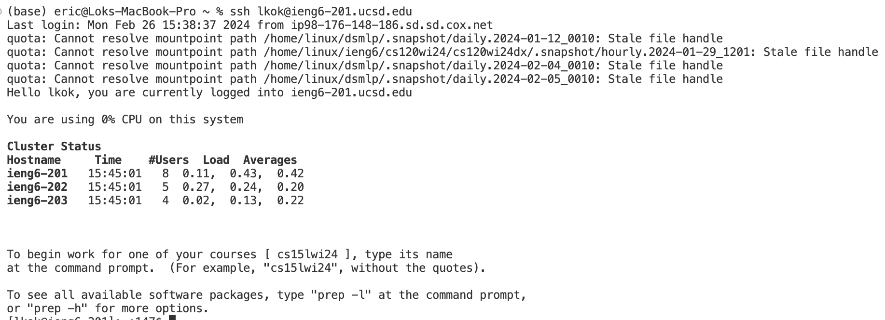
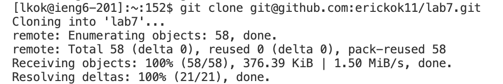
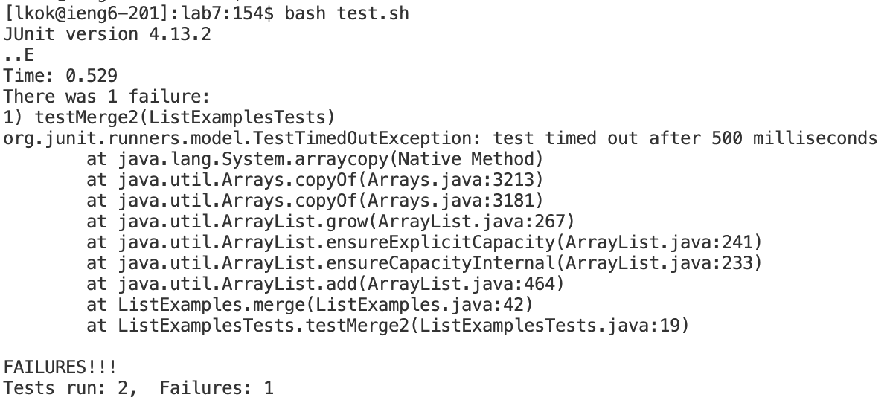
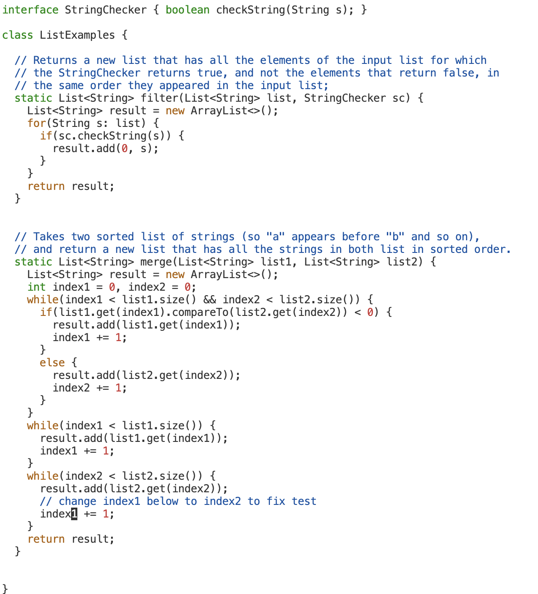
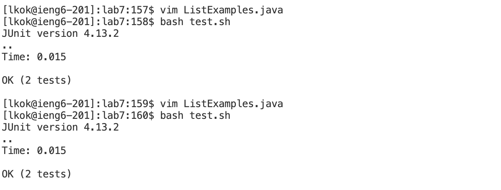
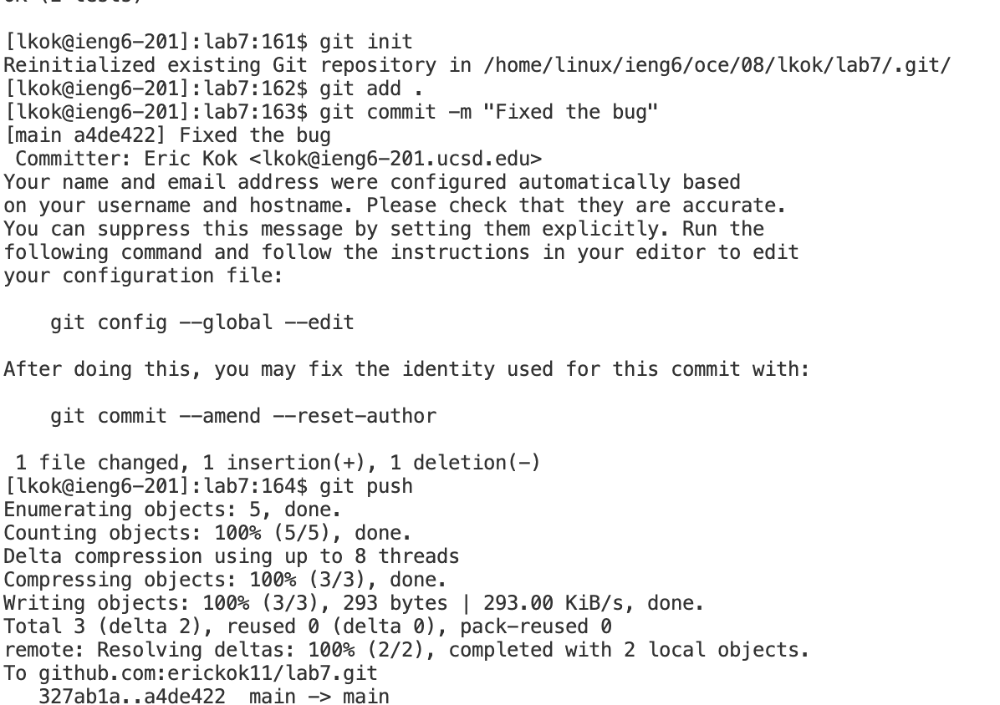

## Lab 4 Report
### Step 4(Log in to ieng6)

~~~
Key pressed: ssh<space>lkok@ieng6-201.ucsd.edu<enter> This command is used to log in to the ieng6 system.
Since the key is saved on my computer, so it did not prompt me to enter the password.
~~~

### Step 5(clone the repository)

~~~
Key pressed: git<space>clone<space><command-v> This command is used to clone the repository. Since I have copied the link
to the clip board. I pressed <ctrl-v> to paste the link after the command.
~~~

### Step 6 (Run the test)

~~~
Key pressed: cd<space>l<tab><enter> This step is the set the current directory to the lab7 directory.
bash<space>te<tab><enter> This step is to run the test.sh shell script. I pressed tab in this steps to let the terminal
autofill the remaining command for me to reduce the time used to type the whole file name.
~~~

### Step 7 (Edit the code file)

~~~
Key pressed: vim<space>ListEx<tab><.>j<tab><enter> This step is to use the vim editor to open the file I wanted to edit.
</>change<enter><down><right><right><right>i<backspace>2 First I used </>change to find the word change in the file to
locate the code I wanted to change in the file. Then I used arrow keys to move to the place I want to fix. Then I pressed
i to change it to insert mode. I then pressed <backspace> to delete "2" and inserted 1 to fix the code.
<esc><:>wq<enter> Finally, I pressed <esc> button the back to normal mode and typed <:>wq to quit the editor with savings.
~~~ 

### Step 8 (Rerun the tests)

~~~
Key pressed: <up><up><enter> Since I haved already run the command that runs the tests script in the last two steps, therefore
I pressed up arrow key for two times to retrive that command and press enter to run it again.
~~~

### Step 9 (Commit and push)

~~~
Key pressed:
git<space>init<enter> This command is used to create a new git repository.
git<space>add<space><.><enter> This command is used to add a change to the git repository.
git<space>commit<space><->m<space><">Fixed<space>the<space>bug<"><enter> This command is to commit the changes to the git. The -m command is to leave messages for commiting the changes.
git<space>push<enter> This is the command used to upload the local repository to the remote repository.
