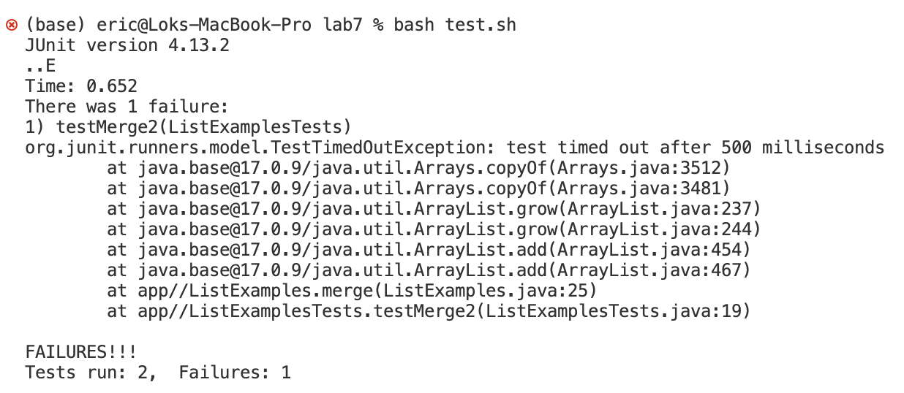
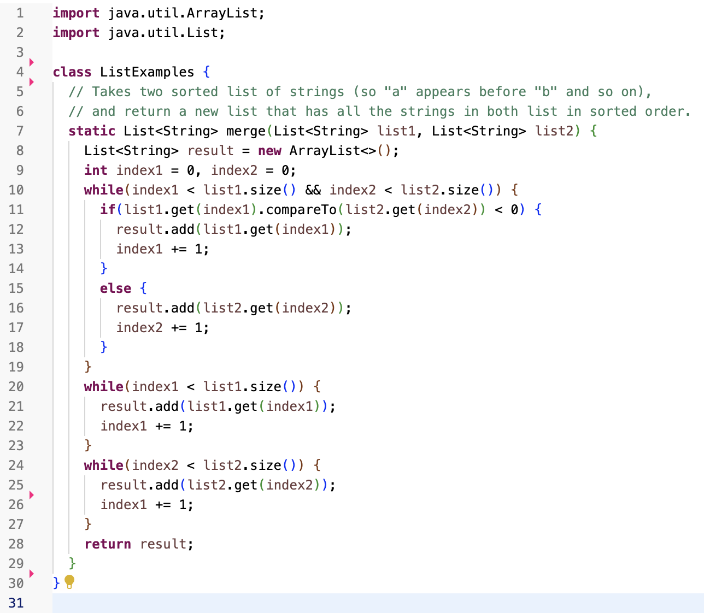
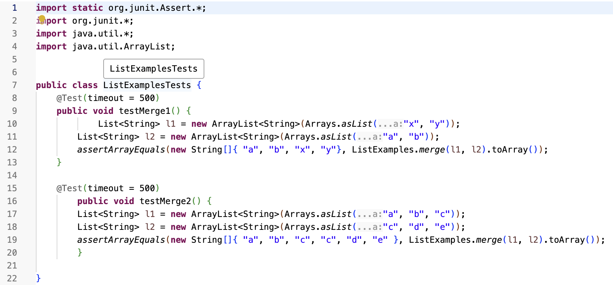
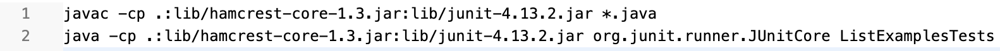
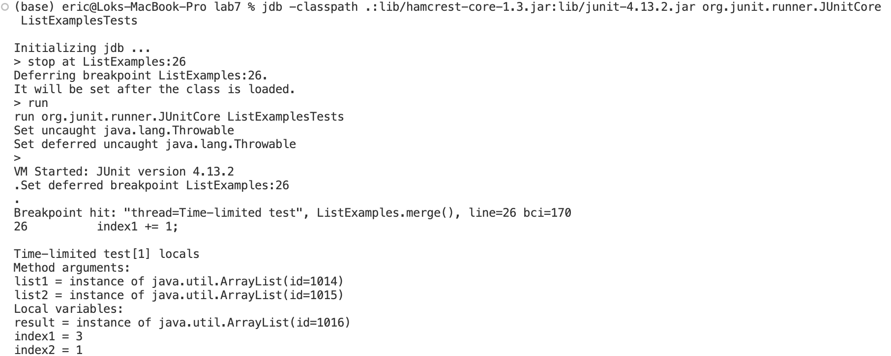
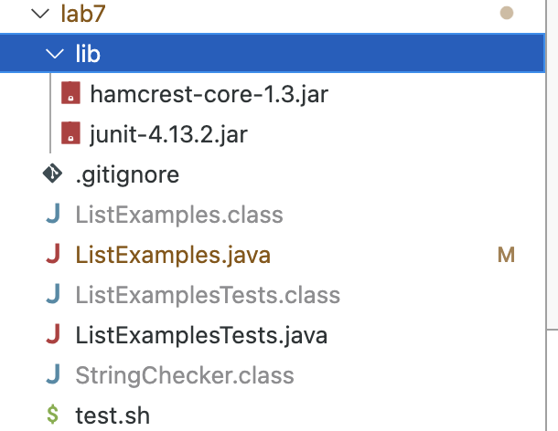

# Lab Report 5
## Part 1 - Debugging Scenario

### Post From Student
Need help debugging my code
I ran into some bugs with my code from the ListExamples. When I try to run the test cases, it says 1 failure and test timed out after 500 milliseconds.
Heres are the screen shot running the tests and my codes.
command line

code

test cases

bash script


### Response from TA
Hi, seems like there is an infinite loop from your code so when you run a test, the test will timed out. You can use the below command to run your code
in jdb and find the bug!
```
javac -g -cp .:lib/hamcrest-core-1.3.jar:lib/junit-4.13.2.jar *.java
jdb -classpath .:lib/hamcrest-core-1.3.jar:lib/junit-4.13.2.jar org.junit.runner.JUnitCore ListExamplesTests
```
Notice that the first line of a command include the "-g" command which is a special command line option that adds debugger information to the class file.
Also, from the second line of the command, notice that it is using "-classpath" command line option instead of using normal "-cp".
After running the above command, you may want to set a breakpoint in the ListExample.java file so that you can find where the bug is.
After that you can use the "run" command to run the code and use "locals" command to list all the local variables from the code and see what local variables
are triggering the infinite loop

### Outputs after trying the advice

The bug here is that the third while loop of the code is an infinite loop. It is because the third while loop should increment index2. However, the code here
is incrementing the index1, so the loop will never be ended. 

### More Information about the scenario
Description to fix the bug:
To fix the bug, we need to replace the index1 in the third loop to index2.
Directory Structure:


## Part 2 - Reflection
I have learnt a lot of cool things from my lab experience in the second half of this quarter. However, one thing that I was most impressed is the vim editor.
I never knew that I can edit my code or other files all from my terminal using the vim editor. The coolest thing about using the vim editor is that there
is a lot of keyboard shortcut to help editting my code in a faster way. For example using I to enter the insert mode or using dd the delete the whole thing.
Those are very convinient for editing my code.
